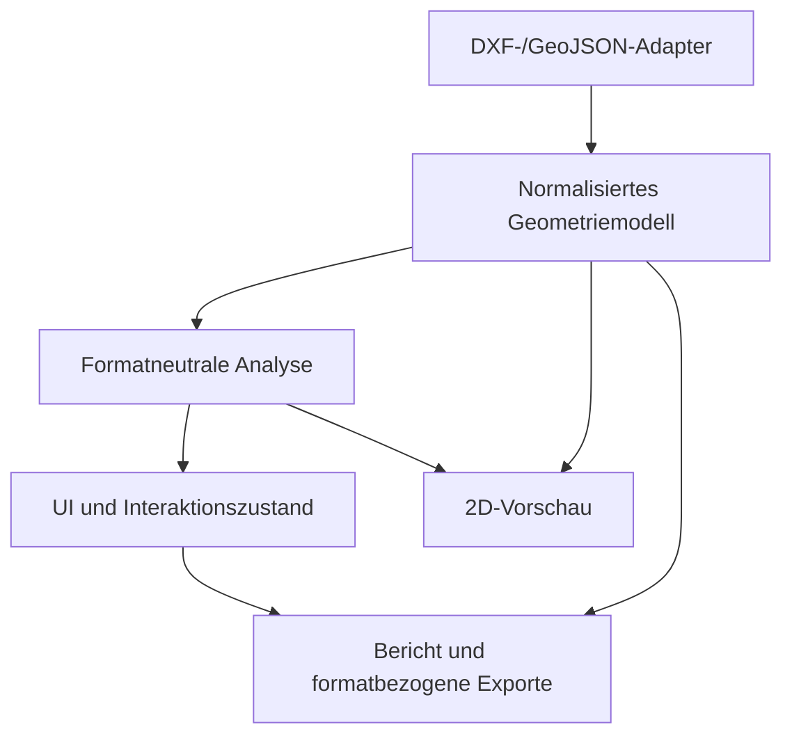

# Architektur

**Status:** initiale Zielarchitektur  
**Datum:** 12. Juli 2026

## 1. Grundentscheidung

Die erste Version ist eine statisch auslieferbare, lokale SPA mit Vite und
strengem TypeScript. Dateien werden im Browser gelesen und verlassen das Gerät
nicht.

Die Architektur trennt fünf Schichten:



## 2. Normalisiertes Modell

Alle Importer liefern `GeoDataset` mit:

- Quelldatei und Format
- optional deklariertem CRS
- normalisierten Features
- Layername und Quellentitätstyp
- 64-Bit-JavaScript-Koordinaten
- Importwarnungen und Verlustbilanz

Analyse und Vorschau kennen keine DXF-Group-Codes oder GeoJSON-Struktur. Dadurch
kann später ein DWG-Konverter denselben Modellvertrag bedienen.

## 3. Koordinatenpräzision

JavaScript-Zahlen bleiben im Kern `Number`/Float64. Erst der Renderer berechnet
pro View eine lokale Transformation:

```text
Bildschirmkoordinate = (Weltkoordinate - View-Ursprung) × Maßstab
```

Dadurch bleiben große Vermessungskoordinaten stabil. Eine frühe Umwandlung in
`Float32` ist zu vermeiden.

## 4. Analyse-Engine

Die Engine ist rein funktional und unabhängig von DOM und Canvas. Sie erzeugt:

- Feature-Statistiken
- räumliche Cluster
- Hauptcluster-Kandidat
- vollständige und fokussierte Bounds
- Ausdehnungsfaktor
- Z-Statistik
- CRS-Plausibilitäten
- Befunde mit betroffenen Feature-IDs
- Empfehlungen, aber keine Mutation der Quelldaten

Für die Clusterbildung wird ein räumliches Grid mit Union-Find verwendet. Damit
müssen nicht alle Featurepaare miteinander verglichen werden. Das Ziel ist ein
annähernd linearer Pfad für typische, lokal dichte Zeichnungen.

## 5. Rendering

Der Prototyp verwendet Canvas 2D:

- geringe Abhängigkeiten
- gute Eignung für eine 2D-Diagnoseansicht
- einfache lokale Origin-Verschiebung
- Übersicht und Fokus können mit demselben Renderer erzeugt werden

Der Renderer wird dreimal mit unterschiedlichen Featuremengen verwendet:
Gesamtausdehnung, Hauptbereich und vermuteter Störbereich. Der Störbereich
umfasst bei vorhandener Entfernungsempfehlung genau diese Features; in
mehrdeutigen Fällen werden die Nicht-Hauptcluster lediglich als Prüfbereich
dargestellt.

Für sehr große Dateien bleibt ein WebGL-Renderer als spätere Ausbaustufe offen.
Die normalisierte Daten- und Analyseebene darf davon nicht abhängen.

### OSM-Kartenvorschau

Die geografische Plausibilitätsprüfung verwendet Leaflet als reine 2D-Karten-
UI. Die CRS-Definitionen und Aliase entsprechen der bestehenden
`CrsProjection`-Implementierung des Pointcloud Managers:

- EPSG:25832
- EPSG:25833
- EPSG:31468
- EPSG:3857

`proj4` transformiert Cluster-Bounds nach WGS84. Zusätzlich zur technischen
Transformierbarkeit prüft die SPA das plausible Einsatzgebiet des CRS. So wird
der reale Fast-50/50-Fehlerfall erkannt, bei dem die falschen Koordinaten formal
transformierbar, aber für UTM Zone 32 geografisch unplausibel sind.

Zusätzlich werden die tatsächlichen normalisierten Feature-Stützpunkte nach
WGS84 transformiert und mit Leaflets Canvas-Renderer über OSM gezeichnet.
Für kartografisch plausible Cluster wird die Geometrie grün und ihre Bounds als
blauer Ausdehnungsrahmen dargestellt; CRS-unplausible Störbereiche bleiben rot.
Um interaktive Karten bei sehr
vertexreichen Dateien nicht zu blockieren, wird die Kartenüberlagerung auf ein
globales Budget von 100.000 Stützpunkten ausgedünnt; erster und letzter Punkt
eines Features bleiben erhalten. Die Analyse selbst arbeitet unverändert auf
allen Punkten.

Der initiale Kartenausschnitt fokussiert den plausiblen Hauptkandidaten statt
alle möglicherweise weltweit getrennten Bounds. Jeder transformierbare Cluster
kann über „Auf Karte zeigen“ einzeln fokussiert werden.

OSM-Kacheln werden nur für den sichtbaren interaktiven Viewport geladen. Der
Endpunkt ist über `VITE_OSM_TILE_URL` austauschbar. Attribution bleibt sichtbar;
Prefetching und Offline-Download sind nicht vorgesehen.

### Internationalisierung

Die Oberfläche verwendet zentrale, typgeprüfte Deutsch-/Englisch-Kataloge in
`src/i18n`. Statische DOM-Texte und barrierefreie Beschriftungen werden über
`data-i18n`-Attribute aktualisiert; dynamische Analyse-, Karten-, Canvas- und
Berichtstexte verwenden dieselbe Übersetzungsfunktion. Die Sprache kann ohne
Neuladen gewechselt werden. Die Auswahl wird ausschließlich lokal unter
`gic.lang` gespeichert; Zahlen und Prozentwerte folgen dem jeweiligen Locale.
Der Konzept-Button öffnet keine rohe Markdown-Datei, sondern die UTF-8-
deklarierte `concept.html`. Sie rendert abhängig von derselben Sprachwahl die
deutsche oder englische Konzeptquelle und verhindert damit browserabhängige
Zeichensatzfehler bei direkt angezeigten `.md`-Dateien.

## 6. Verarbeitung großer Dateien

Mittelfristig werden Parser und Analyse in Web Worker verschoben. Zielpfad:

```text
File/Blob
  → Parser-Worker
  → normalisierte Chunks und laufendes Inventar
  → Analyse-Worker
  → Render-Batches und Befunde
  → UI
```

Für sehr große ASCII-DXF-Dateien ist ein Streaming-Parser sinnvoll. Der
Prototyp liest zunächst den gesamten Text, dokumentiert diese Grenze aber
explizit.

## 7. Cleaning und Roundtrip

Analyse und Bereinigung sind getrennt:

1. `InspectionReport` beschreibt den unveränderten Datensatz.
2. `CleaningPlan` speichert explizite Entscheidungen.
3. Eine Vorschau zeigt die daraus entstehenden Bounds.
4. Ein formatbezogener Exporter erzeugt die Zieldatei.
5. `CleaningAudit` dokumentiert entfernte, transformierte und unveränderte Inhalte.

Bei DXF ist ein „Textzeilen löschen“-Ansatz riskant, weil BLOCKS, INSERTs,
Handles, Owner-Beziehungen und referenzierte Objekte zusammenhängen können.
Der DXF-Exporter braucht deshalb vor Freigabe eine klare Roundtrip-Strategie und
Referenztests.

## 8. Sicherheit und Datenschutz

- keine Dateiübertragung im Standardbetrieb
- keine dynamische Codeausführung aus CAD-Inhalten
- Texte werden nur als Text behandelt, nicht als HTML gerendert
- externe Links verwenden feste, geprüfte URLs
- potenzielle native DWG-Konverter werden nie mit frei manipulierbaren
  Kommandozeilenargumenten gestartet
- Größen- und Laufzeitlimits schützen vor absichtlich problematischen Dateien
- die OSM-Karte überträgt keine DXF-Geometrie, erzeugt aber externe Tile-
  Requests, aus denen Kartenbereich und IP-Adresse hervorgehen können

## 9. Erweiterungspunkte

- zusätzliche DXF-Entitäten und BLOCK-Expansion
- Referenzdatei oder manuell gesetzte Projekt-Bounds
- räumliche Multi-Skalen-Clusterung
- Duplikat- und Near-Duplicate-Erkennung
- Selbstschnitt-, Nullsegment- und Ringvalidierung
- CRS-Transformation mit `proj4`
- WebGL-Vorschau
- PWA-/Desktop-Verpackung
- DWG-Konvertierungsadapter
