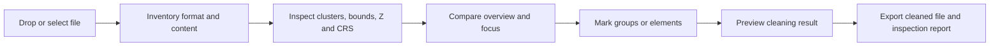

# Product and UX Concept

**Status:** initial draft

**Date:** July 12, 2026

## 1. Problem

In practice, DXF and other CAD/geodata files often contain several groups of
content that are far apart spatially. Typical examples include:

- the actual survey or design geometry at the project location,
- title blocks and drawing frames at remote coordinates,
- sections or detail drawings outside the site plan,
- block references with an unsuitable insertion point,
- geometry at `(0, 0)` or with an incorrect local origin,
- individual damaged coordinates with extremely large values,
- mixed data from different coordinate reference systems,
- 2D geometry at `Z=0` alongside genuine 3D elevations.

Even a few such elements can expand the full bounds by thousands of kilometres.
“Zoom all” then shows almost nothing; GIS/CAD exports, spatial checks and
downstream algorithms receive misleading extents.

## 2. Product Promise

Before cleaning, the app answers four questions in a traceable way:

1. **What does the file contain?**
2. **Which spatially separated groups exist?**
3. **Why is a group likely to be suspicious?**
4. **What will actually be removed or changed during cleaning?**

The application is not a CAD editor. It is a diagnostic, decision and cleaning
tool used before further processing.

The user interface can be switched immediately between German and English. The
selection remains stored locally in the browser and applies consistently to
static UI text, analysis findings, map information, number formats and
inspection reports.

## 3. Target Groups

- surveying companies
- construction and planning offices
- GIS users
- drone and photogrammetry workflows
- users of point-cloud and as-built documentation
- developers importing third-party CAD/GIS files into automated pipelines

## 4. Primary Workflow

## 5. SPA Information Architecture

### Left column: file and analysis parameters

- file drop zone
- format, size and declared version
- number of layers, entities and vertices
- detected or presumed coordinate location
- configurable cluster distance
- Z tolerance
- optional reference bounds or reference file

### Centre: spatial preview

The preview is deliberately split into three linked parts:

1. **Full extent** shows all spatial groups. Elements thousands of kilometres
   away must remain visible and selectable.
2. **Focus area** shows the probable main area without groups classified as
   remote.
3. **Suspected disturbance area** shows the non-primary clusters separately. If
   the main area is unambiguous or manually confirmed, it is labelled “removal
   recommended”. An ambiguous automatic choice remains explicitly labelled
   “review”.

This comparison makes the problem easier to understand than a single viewer in
which the main geometry appears only as a pixel.

### Map check

If a supported CRS is declared, the clusters are additionally checked on an
OpenStreetMap map:

- mappable clusters appear with bounds and centre,
- imported DXF/GeoJSON lines, points and polygons are drawn directly over the
  map,
- main and disturbance areas receive clearly distinguishable boundary markers,
- geographically plausible geometry is green with a blue extent frame; the
  suspected disturbance area is red,
- transformed locations outside the plausible CRS area of use are listed
  separately as implausible,
- the user can explicitly select a mappable cluster as the main area,
- a manual map selection replaces the uncertain majority decision when clusters
  are nearly equal in size.
- “Show on map” focuses each technically displayable cluster individually so a
  remote area does not recreate an unusable full-extent zoom.

The geometry remains local. OSM raster tiles are nevertheless loaded online for
the current viewport. This external request is disclosed in the user interface.

### Right column: findings and decisions

- spatially separated clusters
- distance from the main area
- number of contained entities and layers
- effect on the bounds
- Z=0 groups
- invalid or non-finite coordinates
- unsupported or approximated entity types
- CRS information and conflicts
- recommendation to `keep`, `review` or `remove`
- explicit user decision

## 6. Interaction Principles

### No silent automation

The app may recommend removal, but it must not apply it without a confirmed
export. Users must be able to see which entities are affected.

### Overview and detail remain linked

Selecting a finding highlights the associated elements in both previews.
Selecting an element in the preview opens the related finding, layer and source
type.

### Heuristics are explained

Instead of merely displaying “outlier”, the app can state, for example:

> 37 entities form a separate cluster 19,958 km from the main area. Without
> this cluster, the XY extent shrinks from 19,960 km to 430 m.

### CRS detection remains cautious

Coordinate values alone do not prove a particular EPSG system. The interface
therefore distinguishes between:

- **declared:** reliably obtained from file metadata,
- **plausible:** the value range matches a CRS family,
- **unknown:** no reliable assignment is possible,
- **contradictory:** declared metadata and coordinates do not agree.

## 7. Finding Classes

| Finding | Meaning | Default recommendation |
|---|---|---|
| Remote cluster | separate group outside the main spatial context | review; remove if there is a clear main majority |
| Extent inflation | full bounds are substantially larger than focus bounds | information |
| Z=0 in 3D file | complete shapes at Z=0 alongside genuine elevations | review/raise/remove |
| Invalid coordinate | `NaN`, `Infinity` or missing required values | do not export |
| Unsupported entity | parser cannot preserve the content without loss | warning |
| Approximation | for example, a block represented only by its insertion point or an arc by vertices | warning |
| Unclear CRS | no unambiguous declaration | confirm CRS before export |
| Mixed CRS indicators | clusters show incompatible value ranges | do not clean automatically |

## 8. MVP Scope

### Included

- open DXF and GeoJSON locally
- format and loss inventory
- cluster analysis
- full-extent and focus previews
- layer and entity-type statistics
- CRS plausibility display
- selection of complete clusters or individual entities
- export of an inspection report
- cleaned GeoJSON export
- DXF export only after defining and testing a round-trip strategy

### Not included

- general CAD drawing or editing
- complete AutoCAD rendering
- layout/paper-space rendering in the first version
- automatic transformation between unknown CRSs
- DWG write support in the pure SPA
- server-side upload as the default path

## 9. Success Criteria

- A real file containing remote title-block outliers can be opened without
  contacting a server.
- The main area and remote groups are clearly visible at the same time.
- The app explains how a cluster affects the full bounds.
- Every cleaning action is fully traceable before export.
- No unsupported entity type is silently lost.
- The cleaned export can be opened in at least two independent CAD/GIS
  applications.
- Analysis and results remain deterministic for the same file.
