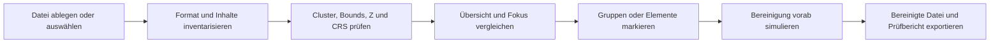

# Produkt- und UX-Konzept

**Status:** initialer Entwurf  
**Datum:** 12. Juli 2026

## 1. Problem

DXF- und andere CAD-/Geodateien enthalten in der Praxis häufig mehrere räumlich
weit voneinander getrennte Inhaltsgruppen. Typische Beispiele sind:

- eigentliche Vermessungs- oder Planungsgeometrie am Projektstandort,
- Planköpfe und Schriftfelder an entfernten Koordinaten,
- Schnitte oder Detailzeichnungen außerhalb des Lageplans,
- Blockreferenzen mit unpassendem Einfügepunkt,
- Geometrie bei `(0, 0)` oder mit falschem lokalen Ursprung,
- einzelne beschädigte Koordinaten mit sehr großen Beträgen,
- vermischte Daten aus unterschiedlichen Koordinatensystemen,
- 2D-Geometrie auf `Z=0` neben echten 3D-Höhen.

Schon wenige solche Elemente können die Gesamt-Bounds um Tausende Kilometer
vergrößern. „Zoom all“ zeigt dann fast nichts mehr; GIS-/CAD-Exporte,
Räumlichkeitsprüfungen und nachgelagerte Algorithmen erhalten irreführende
Ausdehnungen.

## 2. Produktversprechen

Die App beantwortet vor einer Bereinigung nachvollziehbar vier Fragen:

1. **Was ist in der Datei enthalten?**
2. **Welche räumlich getrennten Gruppen gibt es?**
3. **Warum ist eine Gruppe wahrscheinlich auffällig?**
4. **Was wird bei einer Bereinigung tatsächlich entfernt oder verändert?**

Die Anwendung ist kein CAD-Editor. Sie ist ein Diagnose-, Entscheidungs- und
Bereinigungswerkzeug vor der Weiterverarbeitung.

Die Bedienoberfläche ist unmittelbar zwischen Deutsch und Englisch umschaltbar.
Die Wahl bleibt lokal im Browser gespeichert und gilt einheitlich für statische
UI-Texte, Analysebefunde, Kartenhinweise, Zahlenformate und Prüfberichte.

## 3. Zielgruppen

- Vermessungsbüros
- Bau- und Planungsbüros
- GIS-Anwender
- Drohnen- und Photogrammetrie-Workflows
- Anwender von Punktwolken- und Bestandsdokumentationen
- Entwickler, die fremde CAD-/GIS-Dateien in automatisierte Pipelines übernehmen

## 4. Primärer Arbeitsablauf

## 5. Informationsarchitektur der SPA

### Linke Spalte: Datei und Analyseparameter

- Dateiablage
- Format, Größe und deklarierte Version
- Anzahl Layer, Entitäten und Vertices
- erkannte beziehungsweise vermutete Koordinatenlage
- konfigurierbarer Clusterabstand
- Z-Toleranz
- optionale Referenz-Bounds oder Referenzdatei

### Mitte: räumliche Vorschau

Die Vorschau wird bewusst in drei gekoppelte Bereiche geteilt:

1. **Gesamtausdehnung** zeigt alle räumlichen Gruppen. Auch tausende Kilometer
   entfernte Elemente müssen sichtbar und auswählbar bleiben.
2. **Fokusbereich** zeigt den wahrscheinlichen Hauptbereich ohne die als entfernt
   eingestuften Gruppen.
3. **Vermuteter Störbereich** zeigt die Nicht-Hauptcluster separat. Bei einer
   eindeutigen oder manuell bestätigten Hauptregion erscheint die Kennzeichnung
   „Entfernung empfohlen“. Bei einer mehrdeutigen automatischen Wahl bleibt sie
   ausdrücklich bei „prüfen“.

Diese Gegenüberstellung macht das Problem verständlicher als ein einzelner
Viewer, in dem die Hauptgeometrie nur als Pixel erscheint.

### Kartenprüfung

Bei deklariertem und unterstütztem CRS werden die Cluster zusätzlich auf einer
OpenStreetMap-Karte geprüft:

- kartierbare Cluster erscheinen mit Bounds und Mittelpunkt,
- importierte DXF-/GeoJSON-Linien, Punkte und Polygone werden direkt über der
  Karte dargestellt,
- Haupt- und Störbereich erhalten zusätzlich klar unterscheidbare
  Bereichsgrenzen,
- kartografisch plausible Geometrie erscheint grün mit blauem
  Ausdehnungsrahmen; der vermutete Störbereich erscheint rot,
- transformierte Lagen außerhalb des plausiblen CRS-Einsatzgebiets werden
  separat als unplausibel ausgewiesen,
- der Anwender kann einen kartierbaren Cluster ausdrücklich als Hauptbereich
  wählen,
- eine manuelle Kartenwahl ersetzt die unsichere Mehrheitsentscheidung bei
  nahezu gleich großen Clustern.
- „Auf Karte zeigen“ fokussiert jeden technisch darstellbaren Cluster einzeln,
  damit weit entfernte Bereiche nicht erneut einen unbrauchbaren Gesamtzoom
  erzwingen.

Die Geometrie bleibt lokal. OSM-Rasterkacheln werden jedoch online für den
aktuellen Viewport geladen. Dieser externe Zugriff ist in der Oberfläche
sichtbar zu erklären.

### Rechte Spalte: Befunde und Entscheidungen

- räumlich getrennte Cluster
- Entfernung vom Hauptbereich
- Zahl der enthaltenen Entitäten und Layer
- Auswirkung auf die Bounds
- Z=0-Gruppen
- ungültige oder nicht endliche Koordinaten
- nicht unterstützte oder approximierte Entitätstypen
- CRS-Hinweise und Widersprüche
- Empfehlung `behalten`, `prüfen` oder `entfernen`
- explizite Benutzerentscheidung

## 6. Interaktionsprinzipien

### Keine stille Automatik

Die App darf eine Entfernung empfehlen, aber nicht ohne bestätigten Export
anwenden. Der Benutzer muss erkennen können, welche Entitäten betroffen sind.

### Übersicht und Detail bleiben gekoppelt

Auswahl eines Befunds markiert die zugehörigen Elemente in beiden Vorschauen.
Auswahl eines Elements in der Vorschau öffnet den zugehörigen Befund, Layer und
Quelltyp.

### Heuristiken werden erklärt

Statt nur „Ausreißer“ anzuzeigen, nennt die App beispielsweise:

> 37 Entitäten bilden ein eigenes Cluster 19.958 km vom Hauptbereich entfernt.
> Ohne dieses Cluster schrumpft die XY-Ausdehnung von 19.960 km auf 430 m.

### CRS-Erkennung bleibt vorsichtig

Koordinatenwerte allein beweisen kein bestimmtes EPSG-System. Die Oberfläche
unterscheidet deshalb:

- **deklariert:** aus Dateimetadaten sicher übernommen,
- **plausibel:** Wertebereich passt zu einer CRS-Familie,
- **unbekannt:** keine belastbare Zuordnung,
- **widersprüchlich:** deklarierte Metadaten und Koordinaten passen nicht zusammen.

## 7. Befundklassen

| Befund | Bedeutung | Standardempfehlung |
|---|---|---|
| Entferntes Cluster | eigenständige Gruppe außerhalb des Hauptzusammenhangs | prüfen; bei klarer Hauptmehrheit entfernen |
| Extent-Inflation | Gesamt-Bounds sind erheblich größer als Fokus-Bounds | Hinweis |
| Z=0 in 3D-Datei | vollständige Shapes auf Z=0 neben echten Höhen | prüfen/anheben/entfernen |
| Ungültige Koordinate | `NaN`, `Infinity`, fehlende Pflichtwerte | nicht exportieren |
| Nicht unterstützte Entität | Parser kann Inhalt nicht verlustfrei übernehmen | Warnung |
| Näherung | etwa Block nur über Einfügepunkt oder Bogen als Stützgeometrie | Warnung |
| CRS unklar | keine eindeutige Deklaration | CRS vor Export bestätigen |
| Gemischte CRS-Anzeichen | Cluster zeigen unvereinbare Wertebereiche | nicht automatisch bereinigen |

## 8. MVP-Abgrenzung

### Enthalten

- DXF und GeoJSON lokal öffnen
- Format- und Verlustinventar
- Clusteranalyse
- Gesamt- und Fokusvorschau
- Layer- und Entitätstypstatistik
- CRS-Plausibilitätsanzeige
- Auswahl ganzer Cluster oder einzelner Entitäten
- Export eines Analyseberichts
- bereinigter GeoJSON-Export
- DXF-Export nur bei definierter, getesteter Roundtrip-Strategie

### Nicht enthalten

- allgemeines CAD-Zeichnen oder Editieren
- vollständige AutoCAD-Darstellung
- Layout-/Paperspace-Rendering in erster Version
- automatische Transformation zwischen unbekannten CRS
- DWG-Schreibunterstützung in der reinen SPA
- serverseitiger Upload als Standardweg

## 9. Erfolgskriterien

- Eine reale Datei mit Plankopf-Ausreißern lässt sich ohne Serverkontakt öffnen.
- Hauptbereich und entfernte Gruppen sind gleichzeitig verständlich sichtbar.
- Die App erklärt die Auswirkung eines Clusters auf die Gesamt-Bounds.
- Eine Bereinigung ist vor dem Export vollständig nachvollziehbar.
- Kein nicht unterstützter Entitätstyp geht still verloren.
- Der bereinigte Export lässt sich in mindestens zwei unabhängigen CAD-/GIS-
  Anwendungen öffnen.
- Analyse und Ergebnis bleiben für dieselbe Datei deterministisch.
